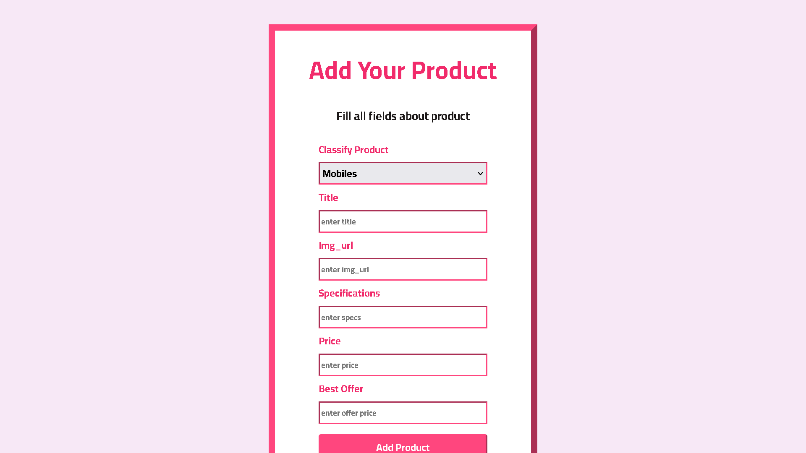
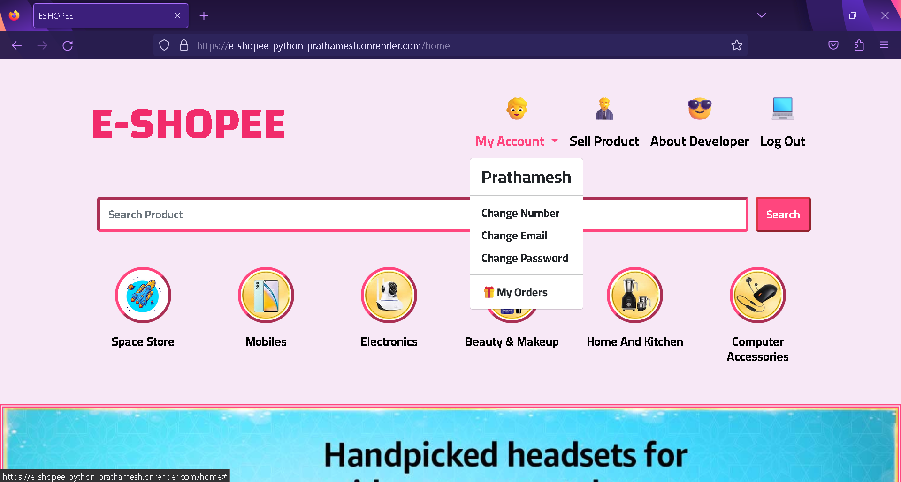

---

# E-SHOPEE

E-SHOPEE is a dynamic e-commerce website powered by Flask, HTML, CSS, and Bootstrap. It allows users to explore and purchase a wide range of products across various categories.

[](https://e-shopee-python-prathamesh.onrender.com/)

## Table of Contents

- [Features](#features)
- [Demo](#demo)
- [Screenshots](#screenshots)
- [Installation](#installation)
- [Usage](#usage)
- [Contributing](#contributing)

## Features

- **User Authentication:** Secure login and registration system.
- **Product Management:** Add and view products effortlessly.
- **Product Categorization:** Easy navigation through product categories.
- **Responsive Design:** Seamless experience across all devices.

## Demo

Visit the live site: [E-SHOPEE](https://e-shopee-python-prathamesh.onrender.com/)


## Screenshots


|:-------------------------------------------:|
| *Login Screen*              |

| *Sign Up Screen*              |

| *Home Screen*              |

| *Navigation Bar and Search Bar *              |

| *Categories*              |

| *Footer*              |

| *Add New Product*              |

| *Authorised Account*              |

| *Product Cards*              |

| *Category Screen 1*              |

| *Category Screen 2*              |

## Installation

1. **Clone the repository:**

```bash
git clone https://github.com/PrathameshPatil-01/E-SHOPEE_PYTHON.git
cd E-SHOPEE_PYTHON
```

2. **Install Dependencies:**

```bash
pip install -r requirements.txt
```

## Usage

1. **Set Up Environment Variables** (if needed).

2. **Initialize the Database:**

```bash
python main.py
```

3. **Open a web browser and go to:**

```
http://localhost:5000
```

4. **Create an account or log in** to start browsing and shopping.

## Contributing

We welcome contributions! To get started:

1. **Fork the repository.**

2. **Create a new branch** for your feature or bug fix:

```bash
git checkout -b feature/my-feature
```

3. **Make your changes** and commit them:

```bash
git commit -m "Add my feature"
```

4. **Push to your forked repository:**

```bash
git push origin feature/my-feature
```

5. **Create a pull request** on the original repository.
